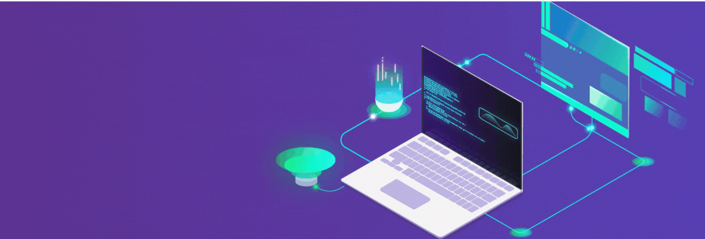

  

## About Me

Hi there! I'm **Al Hasan Dhali**. I'm a passionate **Full Stack Developer** with hands-on experience in **HTML, CSS, JavaScript, React, Tailwind, DaisyUI, Node.js, MongoDB, Spring Boot and MySQL**. I love building **responsive, dynamic and user-friendly web applications** and sharing knowledge through teaching and tutorials.

From creating **web layouts, forms and interactive components** to handling **backend APIs, databases and authentication**, I enjoy solving real-world problems with code. Outside of coding, I enjoy exploring **new technologies, reading articles and improving my development workflow**.

If you want to learn more or follow my projects, feel free to connect!

  &nbsp;
  &nbsp;
  &nbsp;
  

